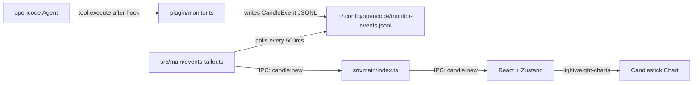

# Architecture

## Data Flow



## IPC Communication

The renderer never accesses the filesystem directly. All data flows through IPC:

| Channel | Direction | Payload | Trigger |
|---------|-----------|---------|---------|
| `candle:new` | main → renderer | `CandleEvent` | New event in JSONL |
| `opencode:status` | main → renderer | `{ connected: boolean }` | File watcher state |
| `opencode:reset` | main → renderer | — | User clicks reset |
| `window:open-settings` | renderer → main | — | User clicks settings button |
| `plugin:install` | renderer → main | — | User clicks install plugin |
| `window:set-pin` | renderer → main | `boolean` | User toggles pin |
| `window:close` | renderer → main | — | User clicks close |

## Window Architecture

### Main Window (480×270)

- Frameless, draggable via TitleBar
- Always-on-top (toggleable via pin button)
- Positioned on the right side of the primary display
- Components: TitleBar, CandlestickChart, StatusPanel

### Settings Window (280×380)

- Frameless, non-modal
- **NOT** always-on-top
- Opened via IPC `window:open-settings`
- Query param routing: `?view=settings` renders `SettingsApp`
- Adaptive positioning: defaults to RIGHT of main window, switches to LEFT only when right side lacks 280px of space
- Uses `screen.getDisplayNearestPoint()` for correct multi-monitor behavior
- Sends settings changes back to main window via IPC:
  - `settings:theme-changed` — `"dark"` / `"light"`
  - `settings:color-scheme-changed` — `"redUp"` / `"greenUp"`
  - `settings:locale-changed` — `"en"` / `"zh"`

## Component Tree (Renderer)

```
<App> / <SettingsApp>          ← routed by ?view=settings
├── <TitleBar>                 ← drag region, pin, settings, close buttons
├── <CandlestickChart>         ← lightweight-charts CandlestickSeries
├── <StatusPanel>              ← cumulative close, K-line history, status light
└── <SettingsApp>              ← theme, color scheme, locale, plugin install (standalone)
```

All UI state lives in a single Zustand store. IPC listeners in `App.tsx` dispatch directly to store actions.
